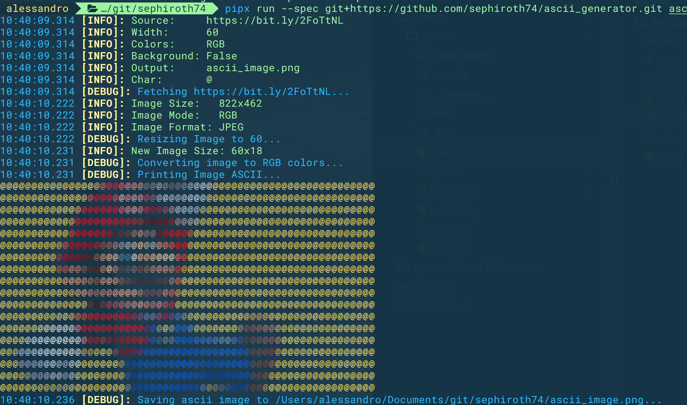

## ASCII Generator

Simple image to ascii art generator for python 3.6+

## Installation

Run using pipx:

https://pipxproject.github.io/pipx/

Exmaple:

    pipx run --spec git+https://github.com/sephiroth74/ascii_generator.git ascii_generator https://bit.ly/2FoTtNL

use `ascii_generator --help` to see all optional arguments

# Full example

This code:

    pipx run --spec git+https://github.com/sephiroth74/ascii_generator.git ascii_generator https://bit.ly/2FoTtNL --width=60 --char=@ --colors=RGB --output=ascii_image.png

will generate an output like this:

